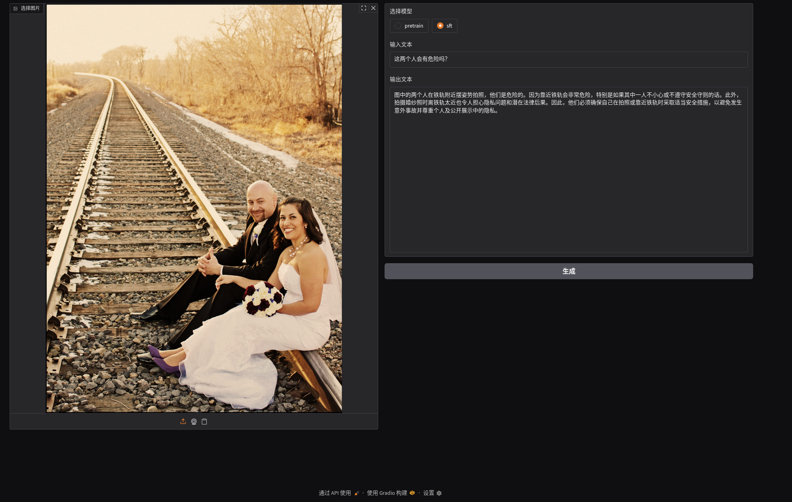

# NanoVLM from Scratch 🚀

一个基于 **Qwen3-0.6B** 和 **SigLIP** 构建的轻量级视觉语言模型（VLM）项目。本项目实现了从零开始的视觉特征对齐与多模态理解。

---

## 🖼️ 界面演示


*图：使用 Gradio 构建的交互界面，展示了模型对复杂场景的安全分析能力。*

---

## 🌟 项目亮点

* **极简架构**：采用 **Qwen3-0.6B** 作为语言模型底座，仅 600M 参数即可实现流畅的中文理解与生成。
* **高效视觉对齐**：视觉部分使用 `siglip-base-patch16-224`。相比传统 CLIP，SigLIP 在图文对齐任务上具有更强的特征捕获能力。
* **端到端推理**：完整实现了图像经过 Vision Encoder、Projection Layer 再到 LLM 的多模态信息流。
* **交互友好**：内置 Gradio WebUI，支持图片上传、文本交互以及 `Pretrain`/`SFT` 模型模式切换。

---

## 🏗️ 模型架构 (Architecture)

该项目遵循主流 VLM 的结构设计：

1.  **Vision Encoder**: `google/siglip-base-patch16-224` —— 负责将图像转化为特征向量。
2.  **Projection Layer**: 连接视觉与语言的桥梁，将图像特征映射到 LLM 的嵌入空间。
3.  **LLM**: `Qwen3-0.6B` —— 负责接收视觉信号并结合文本指令生成最终回复。

---

## 🚀 快速上手

### 1. 克隆仓库
```bash
git clone git@github.com:zhaoxincai/nanoVLM.git
cd NanoVLM
=======

